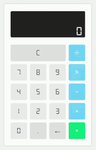

# Calculadora

Esta é uma calculadora simples desenvolvida com HTML, CSS e JavaScript. 

## Funcionalidades

- Realizar operações básicas como adição, subtração, multiplicação e divisão.
- Exibir a operação e seu resultado no visor.
- Exibir historico de operações.
- Operável via teclado.
- Limpar o visor com o botão "C".
- Apagar o último dígito digitado com o botão "←".

## Como utilizar

https://fabiomateus1510.github.io/calculadora/

## Contribuição

Contribuições são sempre bem-vindas! Sinta-se à vontade para reportar problemas ou enviar melhorias através das issues do Github. Caso você queira contribuir, siga os passos abaixo:

1. Realize um fork deste repositório
2. Crie uma nova branch com suas alterações: `git checkout -b minha-branch`
3. Realize suas alterações e commit: `git commit -am 'Adiciona novas funcionalidades'`
4. Realize o push para a branch: `git push origin minha-branch`
5. Crie um novo pull request
